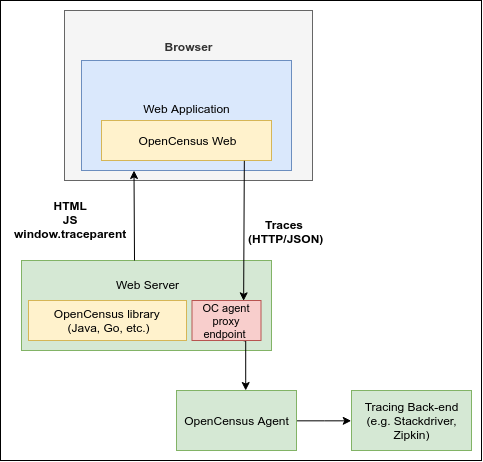
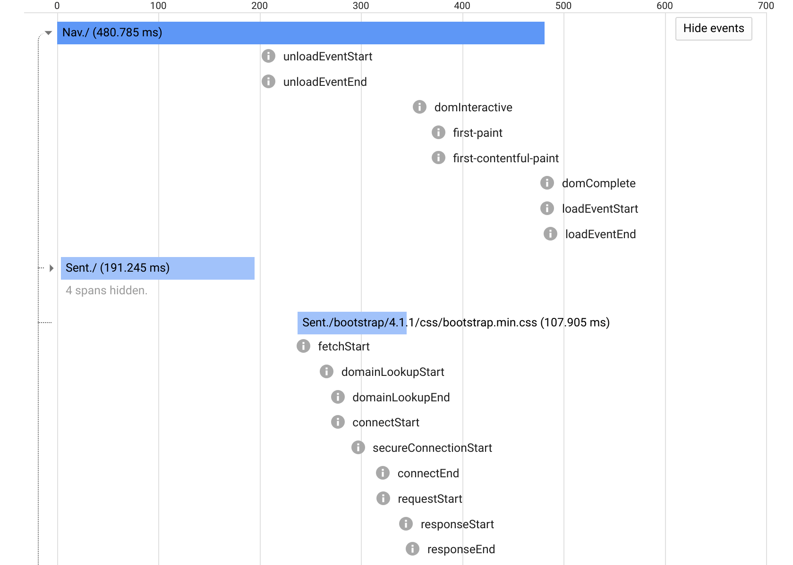
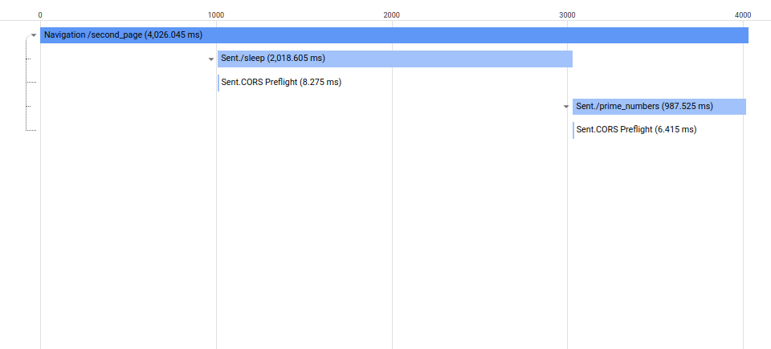
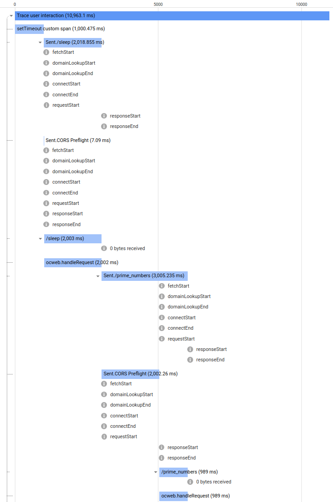
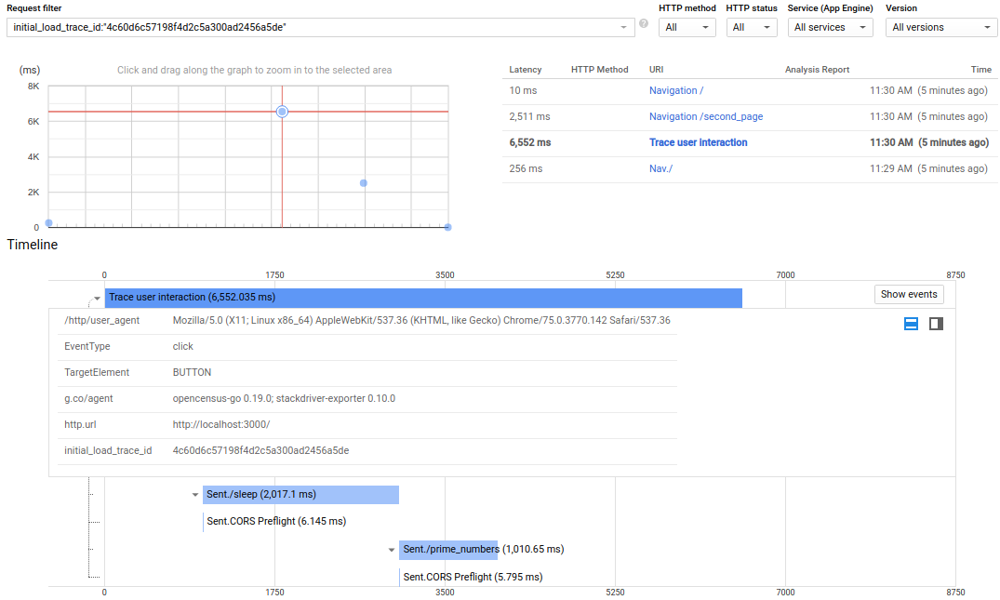

# OpenCensus - A stats collection and distributed tracing framework
[![Gitter chat][gitter-image]][gitter-url]
[![NPM Published Version][npm-img]][npm-url]
[![circleci][circleci-image]][circleci-url]
[![codecov][codecov-image]][codecov-url]
[![Known Vulnerabilities][snyk-image]][snyk-url]
[![Apache License][license-image]][license-url]

OpenCensus Web is an implementation of [OpenCensus][opencensus-url], a toolkit for collecting
application performance and behavior monitoring data. 
This library instruments browser applications to collect user-side performance data.

The library is in alpha stage and the API is subject to change.

Please join [gitter][gitter-url] for help or feedback on this project.

## Overview

OpenCensus Web instruments web applications generates traces for the initial page load of a site 
in the browser and the subsequent on-page user interactions after the initial load. Some features 
that also provides are automatic tracing for *clicks* and *route transitions*, *custom spans*, and browser 
[Resource Timing API][resource-timing-url] data.

It supports sending the trace sampling decision and trace ID from the web server to the
browser client to enable latency debugging across the stack.

## Architecture

OpenCensus Web interacts with three application components:

- *Frontend web server*: renders the initial HTML to the browser including the OpenCensus Web library code 
  and the necessary configuration (e.g. window.ocAgent). This server would typically be instrumented with an 
  OpenCensus server-side library (Go, Java, etc.) that can attach the server-side spans to the trace, 
  that is sending the Trace Context Header in the [W3C draft format][trace-context-url] via a `window.traceparent` 
  global variable.
  We also suggest that you create an endpoint in the server that receives the HTTP/JSON traces and proxies 
  to the OpenCensus Agent.

- *Browser JS*: the OpenCensus Web library code that runs in the browser. This measures user interactions and 
  collects browser data and writes them to the OpenCensus Agent as spans via HTTP/JSON.

- *OpenCensus Agent*: receives traces from either the *frontend web server proxy endpoint* or directly from 
  the *browser JS*, depending on  the way you deploy it, and exports them to a trace backend (e.g. Stackdriver, Zipkin). 



## Features

### Trace spans for initial load including server side HTML rendering

Here's a sample trace from OpenCensus Web that was exported to
[Zipkin][zipkin-url]. Notice that there is an overall `nav./` span for the user
navigation experience until the browser `load` event fires. There are also 
`/` spans for the client and server side measurements of the initial HTML load.
The server side spans also indicates how much time was spent parsing and 
rendering the template:


These spans are generated via the browser's
[Navigation Timing][navigation-timing-url] and
[Resource Timing][resource-timing-url] APIs. Notice also the `long js task`
span, which indicates a CPU-bound JavaScript event loop that took more than 50ms
as measured by the [Long Tasks][long-tasks-url] browser API.

### Span annotations for DOM and network events

The OpenCensus Web spans also include detailed annotations for DOM load events
like `domInteractive` and `first-paint`, as well as network events like
`domainLookupStart` and `secureConnectionStart`. Here is a similar trace
exported to [Stackdriver Trace][stackdriver-trace-url] with the annotations
expanded:



These annotations also comine from the
[Resource Timing API][resource-timing-url]. Note that for resources fetched via
CORS, you will need to specify the
[Timing-Allow-Origin header][timing-allow-origin-url].

### Automatic tracing for click events
OpenCensus Web automatically traces all the *click events* as long as the click is done in a DOM element 
(e.g. button) and it is not *disabled*. When the user clicks an element, an interaction is started to 
measure all the synchronous and asynchronous code that this interaction may trigger, like network calls or 
JS code execution. 

OC Web provides the option of adding the attribute `data-ocweb-id` to HTML elements and give a custom name 
to the interaction. For the next example, the resulting name will be *‘Save edit user info’*:

```html
<button type="submit" data-ocweb-id="Save edit user info"> Save changes </button>
```

In case you don’t add this attribute, OC web will use the *DOM element ID*, the *tag name* plus the *event name* 
involved in the interaction to generate a CSS selector name. For example, clicking this button:

```html
<button id="save_changes"> Save changes </button>
```
would generate a span named: *'button#save_changes click'*.

### Automatic tracing for route transitions
OC Web traces route transitions between the different sections of your page by monkey-patching the 
[History API][history-api-url]. OC Web names this kind of interaction as ‘Navigation /path/to/page’. 
The following trace exported to Stackdriver Trace shows a span named *Navigation /second_page* which 
involves some network calls before the route transition is complete:



### Create your own spans
Instrument your web application with custom spans for tasks or code involved in a user interaction. 
Here is a code snippet in JavaScript that shows how to do this with the npm package dependency:

```javascript
import { tracing } from '@opencensus/web-instrumentation-zone';

function handleClick() {
  // Start child span which will be child of the current root span on the current interaction.
  // To make sure the span is attached to the root span, add this in code that the button is running.
  const childSpan = tracing.tracer.startChildSpan({
    name: 'name of your child span'
  });
  // Do some operation...
  // Finish the child span at the end of it's operation
  childSpan.end();
}

// Create a fake button to point out the custom span is created in the click handler.
const button = document.createElement('button');
button.onclick = handleClick;
```

### Automatic spans for HTTP requests and Browser performance data.
OC Web intercepts HTTP requests generated by an interaction (specifically `XMLHttpRequest` objects) 
to automatically create a span for this HTTP request and measure it. Additionally, OC Web sends along 
the HTTP request a Trace Context Header in the [W3C Trace Context][trace-context-url] format to the server 
as long as the URL is the same origin or matches a provided regex. To provide this *Regex*, 
add the `ocTraceHeaderHostRegex` global variable. 

In case the server is instrumented with OpenCensus, you can see attached the spans coming from the server 
and be able to know the server performance as well. This lets you know if the issues are related to either 
the front-end or the server-side.

OC Web also includes [Performance Resource Timing API][resource-timing-url] data to make annotations like
`domainLookupStart` and `responseEnd`, also, generates spans for any [CORS preflight][cors-preflight-url] requests.

The next screenshot shows a trace exported to Stackdriver Trace. Notice the several network calls with the automatic 
generated spans (e.g. *‘Sent./sleep’*) with the respective annotations. Also, there are server-side 
spans (e.g. *‘/sleep’* and *‘ocweb.handlerequest’*) and *CORS Preflight* related spans.



### Relate user interactions back to the initial page load tracing.
OC Web attaches the *initial page load trace id* to the user interactions as an *attribute* and a *span link*. 
This enables search by attribute to find the *initial load trace* and the interaction traces happening after 
the initial load via a single attribute query.

The next screenshot from Stackdriver Trace shows a search by `initial_load_trace_id` attribute containing all 
user interaction traces after the initial page loaded.



### Export traces to Zipkin, Jaeger, Stackdriver, DataDog, Honeycomb and more

The OpenCensus Web library exports traces via the
[OpenCensus Agent][oc-agent-url], which can then export them to a variety of
trace backends. See the
[OpenCensus Agent/Collector exporter docs][oc-agent-exporter-url] for details.

## Usage

Below are the steps that are currently needed to use it.

### 1. Deploy the OpenCensus agent to collect traces

The OpenCensus Web library currently only exports traces via the
[OpenCensus Agent][oc-agent-url], which can then export them to a trace backend
(e.g. Zipkin, Stackdriver). See this [example's README][initial-load-example-url]
for steps to run the agent locally or in the cloud.

When you run the agent in the cloud you will need to expose it to your
application via the internet. You may also to proxy the agent behind the
authentication or CSRF protection layer of your application to to only allow
traces to be written by authenticated end users.

### 2. Use the OpenCensus Web library code in your application

OpenCensus Web gives tree ways to use it in your application, where you can either
only import the code for the *initial page load* tracing or the whole OpenCensus Web tracing
including the *initial page load* and *user interaction tracing*.

See the [examples/initial_load][examples-initial-load-url] folder for a full
example of how to use *initial page load* functionality in your application. Also, see the 
[examples/user_interaction][examples-user-interaction-url] folder for a full
example of how to also trace the user interactions.

#### Using via a `<script>` tag

You can use OpenCensus Web via a `<script>` tag that makes uses of the
<unpkg.com> CDN that serves files from NPM packages.

The script tag should go before the `</body>`. You will also need to set the
`ocAgent` endpoint in a different `<script>` and may also specify the 
trace sample rate via an `ocSampleRate` global variable as well.

- If you only want to use the **initial page load** functionality:
  ```html
  ...
    <script>
      // HTTP endpoint of the OpenCensus Agent you ran and exposed to the internet
      // in Step 1 above.
      ocAgent = 'https://example.com/my-opencensus-agent-endpoint';

      // Sample all requests for trace, which is useful when testing.
      // By default this is set to sample 1/10000 requests.
      ocSampleRate = 1.0;  
    </script>
    <script src="https://unpkg.com/@opencensus/web-scripts@0.0.5/dist/initial-load-all.js"
            integrity="sha384-VPY9XX7tiXeLekDPFXkfO2AqNpLTCNOzfXxVghzoVP05PXrG+wtHOW2kOP2ggO9o"
            async crossorigin="anonymous">
    </script>
  </body>
  ```

- If you want to **trace user interactions**, you have two options:
  In addition to the previously explained variables, you need to set the `ocTraceHeaderHostRegex`
  regex to tell the OC Web which HTTP requests can be intercepted in a interaction to send the 
  *Trace Context Header*.

  ```html
    ...
    <script>
      // HTTP endpoint of the OpenCensus Agent you ran and exposed to the internet
      // in Step 1 above.
      ocAgent = 'https://example.com/my-opencensus-agent-endpoint';

      // Sample all requests for trace, which is useful when testing.
      // By default this is set to sample 1/10000 requests.
      ocSampleRate = 1.0;
      
      // Send the trace header to all hosts.
      window.ocTraceHeaderHostRegex = /.*/;
    </script>
    ...
  ```

  - If your application doesn't already use the `Zone.js` library, the case for *non-Angular* apps
    (e.g. React, etc.): 
    ```html
        ...
        <script src="https://unpkg.com/@opencensus/web-scripts@0.0.5/dist/tracing-all-with-zone.js"
                integrity="sha384-VPY9XX7tiXeLekDPFXkfO2AqNpLTCNOzfXxVghzoVP05PXrG+wtHOW2kOP2ggO9o"
                async crossorigin="anonymous">
        </script>
      </body>
    ```

  - If your application uses the `Zone.js` library, the case for `Angular` apps:
    ```html
        ...
        <script src="https://unpkg.com/@opencensus/web-scripts@0.0.5/dist/tracing-all-with-zone-peer-dep.js"
                integrity="sha384-VPY9XX7tiXeLekDPFXkfO2AqNpLTCNOzfXxVghzoVP05PXrG+wtHOW2kOP2ggO9o"
                async crossorigin="anonymous">
        </script>
      </body>
    ```

You can also host the bundled scripts from your own site. For
docs on how to build the bundle see the
[@opencensus/web-scripts readme][package-web-scripts].

#### Using as NPM dependency in existing JS build

If you already have a JS build pipeline using e.g. webpack or similar, you can do:

- `npm install @opencensus/web-initial-load` to instrument your application with only 
  the **initial page load** functionality and then set the configuration variables and 
  trigger the recording and exporting of the initial load spans as follows:

  ```js
  import { exportRootSpanAfterLoadEvent } from '@opencensus/web-initial-load';

  window.ocAgent = 'https://example.com/my-opencensus-agent-endpoint';
  window.ocSampleRate = 1.0; // Sample at 100% for test only. Default is 1/10000.

  // Send the root span and child spans for the initial page load to the
  // OpenCensus agent if this request was sampled for trace.
  exportRootSpanAfterLoadEvent();
  ```

- You can `npm install @opencensus/web-instrumentation-zone` or 
  `npm install @opencensus/web-instrumentation-zone-peer-dep`, this depends on whether your
  application already uses `Zone.js` or not (e.g. Angular already does it). Then you can set the
  configuration variables and start the tracing as follows:

  ```js
  // Use @opencensus/web-instrumentation-zone-peer-dep instead in case your app
  // already uses `Zone.js`.
  import { startTracing } from '@opencensus/web-instrumentation-zone';

  window.ocAgent = 'https://example.com/my-opencensus-agent-endpoint';
  window.ocSampleRate = 1.0; // Sample at 100% for test only. Default is 1/10000.
  // Send the trace header to all hosts.
  window.ocTraceHeaderHostRegex = /.*/;

  // This methods starts the tracing and exports the initial page load trace.
  // As the tracing has started, the coming user interactions ares also traced.
  startTracing();
  ```

### 3. Optional: Send a trace parent and sampling decision from your server

OpenCensus Web also supports connecting the server side spans for the initial
HTML load with the client side span for the load from the browser's timing API.
This works by having the server send its parent trace context (trace ID, span ID
and trace sampling decision) to the client.

Because the browser does not send a trace context header for the initial page
navigation, the server needs to fake a trace context header in a middleware and
then send that trace context header back to the client as a global `traceparent`
variable. The `traceparent` variable should be in the
[trace context W3C draft format][trace-context-url]. For example:

```html
  ...
  <script>
    ocAgent = 'https://example.com/my-opencensus-agent-endpoint';
    // Set the `traceparent` in the server's HTML template code. It should be
    // dynamically generated server side to have the server's request trace ID,
    // a parent span ID that was set on the server's request span, and the trace
    // flags to indicate the server's sampling decision (01 = sampled, 00 = not
    // sampled).
    traceparent = '00-{{ServerTraceId}}-{{ServerParentSpanId}}-{{ServerTraceFlags}}';
    // We don't need to specify `ocSampleRate` since the trace sampling decision
    // is coming from the `traceparent` global variable instead.
  </script>
  <script src="https://unpkg.com/@opencensus/web-scripts@0.0.5/dist/initial-load-all.js"
          integrity="sha384-VPY9XX7tiXeLekDPFXkfO2AqNpLTCNOzfXxVghzoVP05PXrG+wtHOW2kOP2ggO9o"
          async crossorigin="anonymous">
  </script>
</body>
```
In case you want to use trace user interactions:

```html
  ...
  <script>
    ocTraceHeaderHostRegex = /.*/;  
    ocAgent = 'https://example.com/my-opencensus-agent-endpoint';
    // Set the `traceparent` in the server's HTML template code. It should be
    // dynamically generated server side to have the server's request trace ID,
    // a parent span ID that was set on the server's request span, and the trace
    // flags to indicate the server's sampling decision (01 = sampled, 00 = not
    // sampled).
    traceparent = '00-{{ServerTraceId}}-{{ServerParentSpanId}}-{{ServerTraceFlags}}';
    // We don't need to specify `ocSampleRate` since the trace sampling decision
    // is coming from the `traceparent` global variable instead.
  </script>
  <script src="https://unpkg.com/@opencensus/web-scripts@0.0.5/dist/tracing-all-with-zone.js"
          integrity="sha384-VPY9XX7tiXeLekDPFXkfO2AqNpLTCNOzfXxVghzoVP05PXrG+wtHOW2kOP2ggO9o"
          async crossorigin="anonymous">
  </script>
</body>
```


To see a full example of how the middleware to generate a trace context header
and send it back to the client, see the
[server.go][initial-load-example-server-go] file and the 
[index.html][initial-load-example-index-html] template in the
[examples/initial_load][initial-load-example-url] folder.

For the case you want to trace user interactions see the 
[user interaction example][examples-user-interaction-url]

## Packages

The OpenCensus web library is composed of the following packages:

- **[@opencensus/web-types][package-web-types]**. This has automatically copied types from the [@opencensus/core][package-core] package of [OpenCensus Node][opencensus-node]. The types are copied because the `@opencensus/core` package has Node-specific dependencies that make it hard to depend on from browser-specific code.
- **[@opencensus/web-core][package-web-core]**. This has the core span and tracer implementation for web browsers. Currently the tracer assumes there is only one current root span for a given browser tab.
- **[@opencensus/web-exporter-ocagent][package-web-exporter-ocagent]**. This handles exporting spans to the [OpenCensus Agent][opencensus-service-url]
- **[@opencensus/web-instrumentation-perf][package-web-instrumentation-perf]**. This is code to convert the initial load resource waterfall timings from the browser [Navigation Timing API][navigation-timing-url] and [Resource Timing API][resource-timing-url] into  the spans for a trace of the overall initial load for a page.
- **[@opencensus/web-propagation-tracecontext][package-web-propagation-tracecontext]**. This provides utilities to serialize and deserialize a `traceparent` trace context header in the [W3C draft trace context format][trace-context-url]
- **[@opencensus/web-initial-load][package-web-initial-load]**. This package is in charge of generating the initial load page trace, plus the corresponding sampling decision for OpenCensus Web and 
storing a global initial load span context to be used by other packages. 
- **[@opencensus/web-scripts][package-web-scripts]**. This depends on all the other OpenCensus Web libraries and provides WebPack builds for JS bundles that can be used in `<script>` tags. See the documentation
for more details on the resulting scripts
- **[@opencensus/web-instrumentation-zone][package-web-instrumentation-zone]**. This depends on all the other OpenCensus Web packages and provides top-level functions for instrumenting the initial page load and 
user interaction traces to export them to the OpenCensus Agent. This also uses `Zone.js` library as a install dependency, then, this package should be used if your application does not already depends on that.
- **[@opencensus/web-instrumentation-zone-peer-dep][package-web-instrumentation-zone-peer-dep]**. This depends on all the other OpenCensus Web packages and provides top-level functions for instrumenting the initial 
page load and user interaction traces to export them to the OpenCensus Agent. This uses `Zone.js` library as a peer dependency, then, this package should be used if your application already depends on that 
(e.g. Angular applications).

## Useful links
- For more information on OpenCensus, visit: <https://opencensus.io/>
- For help or feedback on this project, join us on [gitter][gitter-url]

## Versioning

This library follows [Semantic Versioning][semver-url].

**GA**: Libraries defined at a GA quality level are stable, and will not introduce
backwards-incompatible changes in any minor or patch releases. We will address issues and requests
with the highest priority. If we were to make a backwards-incompatible changes on an API, we will
first mark the existing API as deprecated and keep it for 18 months before removing it.

**Beta**: Libraries defined at a Beta quality level are expected to be mostly stable and we're
working towards their release candidate. We will address issues and requests with a higher priority.
There may be backwards incompatible changes in a minor version release, though not in a patch
release. If an element is part of an API that is only meant to be used by exporters or other
opencensus libraries, then there is no deprecation period. Otherwise, we will deprecate it for 18
months before removing it, if possible.

**Alpha**: Libraries defined at an Alpha quality level can be unstable and could cause crashes or data loss. Alpha software may not contain all of the features that are planned for the final version. The API is subject to change.

## License

Apache 2.0 - See [LICENSE][license-url] for more information.

[circleci-image]: https://circleci.com/gh/census-instrumentation/opencensus-web.svg?style=shield
[circleci-url]: https://circleci.com/gh/census-instrumentation/opencensus-web
[codecov-image]: https://codecov.io/gh/census-instrumentation/opencensus-web/branch/master/graph/badge.svg
[codecov-url]: https://codecov.io/gh/census-instrumentation/opencensus-web
[examples-initial-load-url]: https://github.com/census-instrumentation/opencensus-web/tree/master/examples/initial_load
[examples-user-interaction-url]: https://github.com/census-instrumentation/opencensus-web/tree/master/examples/user_interaction
[gitter-image]: https://badges.gitter.im/census-instrumentation/lobby.svg
[gitter-url]: https://gitter.im/census-instrumentation/lobby?utm_source=badge&utm_medium=badge&utm_campaign=pr-badge&utm_content=badge
[initial-load-example-index-html]: https://github.com/census-instrumentation/opencensus-web/blob/master/examples/initial_load/index.html
[initial-load-example-server-go]: https://github.com/census-instrumentation/opencensus-web/blob/master/examples/initial_load/server.go
[initial-load-example-url]: https://github.com/census-instrumentation/opencensus-web/tree/master/examples/initial_load
[license-image]: https://img.shields.io/badge/license-Apache_2.0-green.svg?style=flat
[license-url]: https://github.com/census-instrumentation/opencensus-web/blob/master/LICENSE
[long-tasks-url]: https://w3c.github.io/longtasks/
[navigation-timing-url]: https://www.w3.org/TR/navigation-timing-2/
[npm-img]: https://badge.fury.io/js/%40opencensus%2Fweb-all.svg
[npm-url]: https://www.npmjs.com/package/@opencensus/web-all
[oc-agent-exporter-url]: https://github.com/census-instrumentation/opencensus-service/tree/master/exporter
[oc-agent-url]: https://github.com/census-instrumentation/opencensus-service
[oc-web-issue-url]: https://github.com/census-instrumentation/opencensus-web/issues/new/choose
[opencensus-url]: https://opencensus.io/
[opencensus-node-url]: https://github.com/census-instrumentation/opencensus-node
[opencensus-service-url]: https://github.com/census-instrumentation/opencensus-service
[package-core]: https://github.com/census-instrumentation/opencensus-node/tree/master/packages/opencensus-core
[package-web-scripts]: https://github.com/census-instrumentation/opencensus-web/tree/master/packages/opencensus-web-scripts
[package-web-core]: https://github.com/census-instrumentation/opencensus-web/tree/master/packages/opencensus-web-core
[package-web-exporter-ocagent]: https://github.com/census-instrumentation/opencensus-web/tree/master/packages/opencensus-web-exporter-ocagent
[package-web-initial-load]: https://github.com/census-instrumentation/opencensus-web/tree/master/packages/opencensus-web-initial-load
[package-web-instrumentation-perf]: https://github.com/census-instrumentation/opencensus-web/tree/master/packages/opencensus-web-instrumentation-perf
[package-web-propagation-tracecontext]: https://github.com/census-instrumentation/opencensus-web/tree/master/packages/opencensus-web-propagation-tracecontext
[package-web-types]: https://github.com/census-instrumentation/opencensus-web/tree/master/packages/opencensus-web-types
[package-web-instrumentation-zone]: https://github.com/census-instrumentation/opencensus-web/tree/master/packages/opencensus-web-instrumentation-zone
[package-web-instrumentation-zone-peer-dep]: https://github.com/census-instrumentation/opencensus-web/tree/master/packages/opencensus-web-instrumentation-zone-peer-dep
[resource-timing-url]: https://www.w3.org/TR/resource-timing-2/
[semver-url]: http://semver.org/
[snyk-image]: https://snyk.io/test/github/census-instrumentation/opencensus-web/badge.svg?style=flat
[snyk-url]: https://snyk.io/test/github/census-instrumentation/opencensus-web
[stackdriver-trace-url]: https://cloud.google.com/trace/
[timing-allow-origin-url]: https://www.w3.org/TR/resource-timing-2/#dfn-timing-allow-origin
[trace-context-url]: https://www.w3.org/TR/trace-context/
[tsickle-url]: https://github.com/angular/tsickle
[zipkin-url]: https://zipkin.io/
[history-api-url]: https://developer.mozilla.org/en-US/docs/Web/API/History
[cors-preflight-url]: https://developer.mozilla.org/en-US/docs/Web/HTTP/CORS#Preflighted_requests